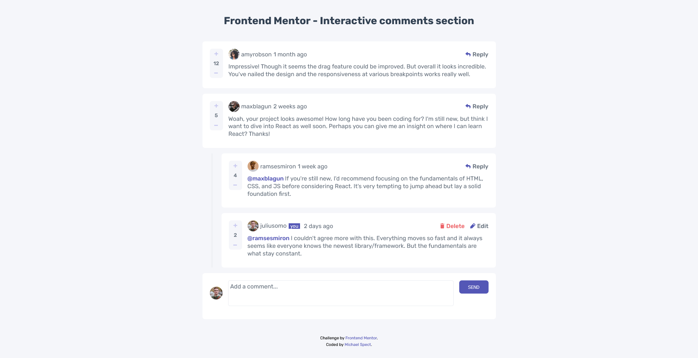
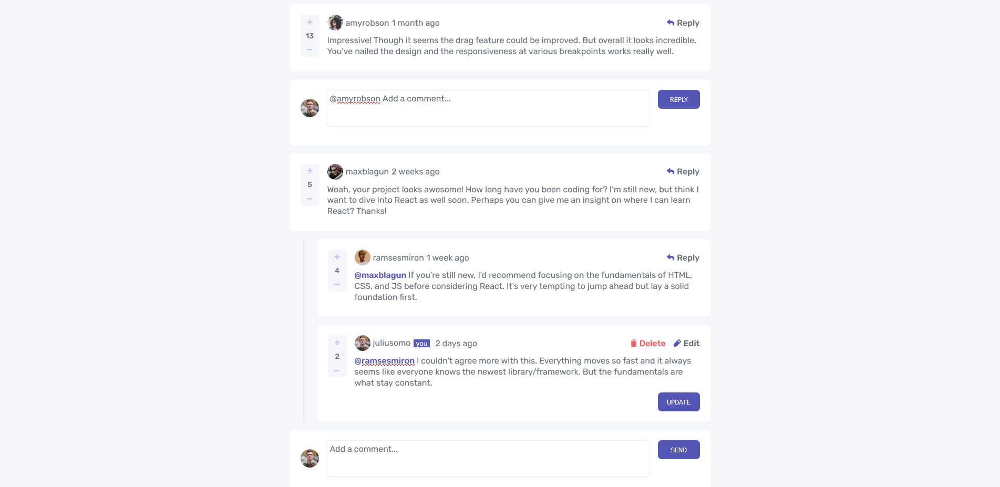
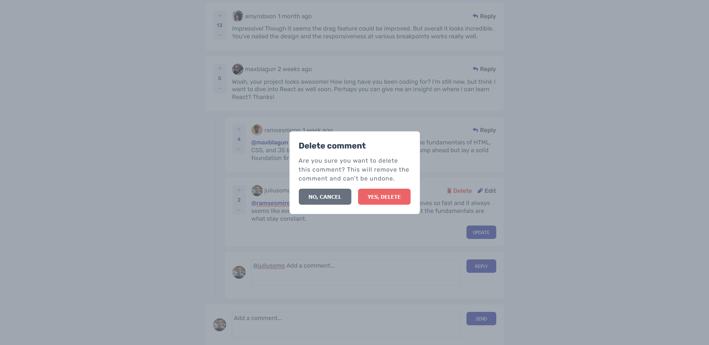

# Frontend Mentor - Interactive comments section solution

This is a my React.js solution to the [Interactive comments section challenge on Frontend Mentor](https://www.frontendmentor.io/challenges/interactive-comments-section-iG1RugEG9). Frontend Mentor challenges help you improve your coding skills by building realistic projects.

## Table of contents

- [Overview](#overview)
  - [The challenge](#the-challenge)
  - [Screenshot](#screenshot)
  - [Links](#links)
- [My process](#my-process)
  - [Built with](#built-with)
- [Author](#author)

## Overview

I'm a beginner in React.js and this is my first React app challenge on my own. It was really interesting. I set up layout design with a combination of flex and css grid. Most challenging thing was to deal with the general app state in order to change some nested children values and not to ruin everything else.
I didn't make the auto cursor focus on edit elements (new, edit, update) firing by button click. I'll appreciate some suggestions for that improvement.

### The challenge

Users should be able to:

- View the optimal layout for the app depending on their device's screen size
- See hover states for all interactive elements on the page
- Create, Read, Update, and Delete comments and replies
- Upvote and downvote comments

### Screenshot

### Links

- Live Site URL: [Add live site URL here](https://interactive-comments-in-react.netlify.app/)

## My process

1. I have started from markup smaller components (Likes.js (comment score), then SingleComment component)
2. Dynamic HTML markup from data.JSON in CommentsList.js component
3. setting css for each component
4. Functional logic of the app (reply, edit, new comment, delete, score comment)
5. Removing logs and bugs...

### Built with

- [React](https://reactjs.org/) - JS library
- Semantic HTML5 markup
- Flexbox
- CSS Grid
- Desktop-first workflow

## Author

- Website - [Miodrag Mladenovic](https://www.miodragmladenovic.com)
- My Music Website - [SoundSpect Music](https://soundspect.com)
- Frontend Mentor - [@michaelspect](https://www.frontendmentor.io/profile/MichaelSpect)
